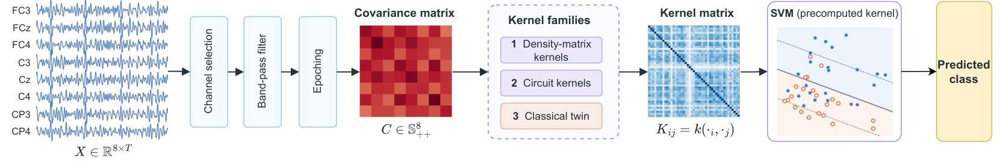
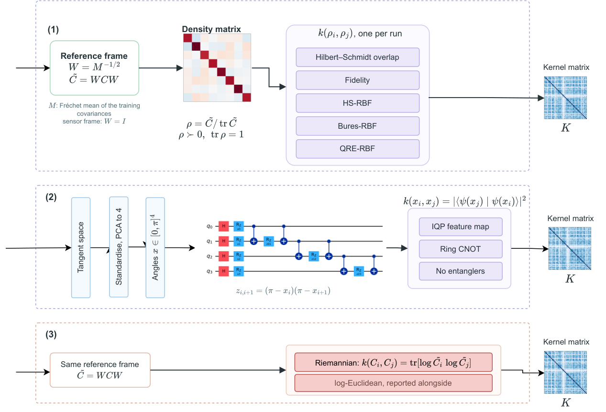
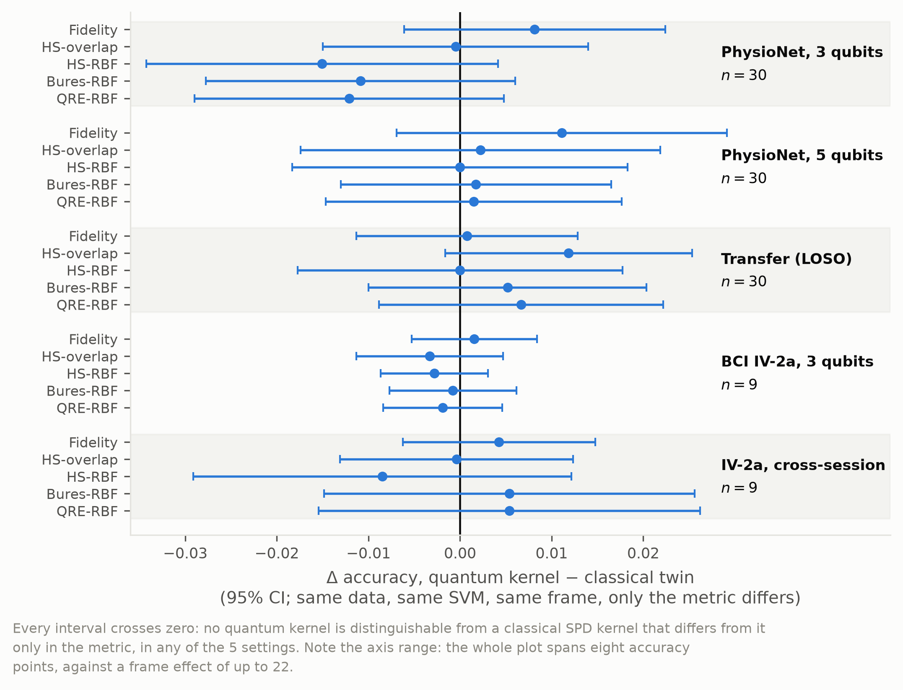
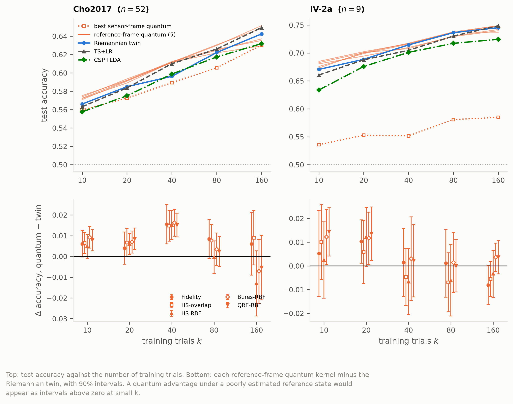

# quantaEEG

**Does quantum structure actually help EEG decoding, or does it only look like it does?**

A controlled benchmark of quantum and quantum-inspired kernels for
brain-computer interface classification, on 3 public datasets, 165 subjects and
268,632 cross-validated fold scores.

The short answer: **almost all of the apparent benefit is a coordinate frame,
not quantum geometry.** This repository contains the control that shows it, and
the one regime where that control does not hold.

```bash
python run.py verify     # recheck every headline claim from the committed data, in seconds
```

No GPU, no downloads, no reruns. It reads `results/`, recomputes the paper's
claims, prints what it found beside what the paper says, and **exits non-zero
if any claim fails or any check is skipped.** Start there; it is faster than
reading this file.

---

## The study in two figures



Every kernel pipeline shares the same front end, EEG to covariance matrix, and
the same back end, kernel matrix to SVM. Only the kernel block in the middle
changes, and it holds three families:



(1) Each trial's spatial covariance `C`, referred to a reference state and
divided by its trace, **is** a quantum density matrix on 3 qubits: an
identity, not an analogy. (2) The circuit kernels take the prevailing route
instead, a few reduced features embedded in a parameterised circuit.
(3) The classical twin uses the same covariances in the same frame and differs
from lane 1 in **one** respect, the metric, which is the whole point.

---

## What was found

| # | Finding | Evidence |
|---|---|---|
| 1 | **The usual comparison is rigged, and not subtly.** Density-matrix kernels are invariant only under *orthogonal* congruence; EEG's nuisances act by the *full* congruence group, which is exactly what the classical Riemannian baselines are invariant to. | one random congruence moves the sensor-frame kernels by **0.17 to 0.35** and the reference-frame ones by **1e-15** |
| 2 | **Fixing the frame produces a large, real gain.** Referring each state to a label-free reference state restores exact invariance. | **+0.064 to +0.102** on PhysioNet, **+0.164 to +0.187** on IV-2a; Gram variance up **4.7 to 9.2x** |
| 3 | **It looks like a quantum advantage.** The headline comparison reverses on all three datasets: on PhysioNet, classical ahead by 0.0635 becomes quantum ahead by 0.0120. | not significant (p = 0.095), but the size and shape this literature reports as an advantage |
| 4 | **The control kills it.** A classical Riemannian kernel, same covariances, same SVM, same tuning budget, same frame, differing only in metric, matches the quantum kernels to about one accuracy point either way. | **32 of 35** comparisons equivalent at ±0.02; worst bound **0.028** across 7 settings; the fidelity kernel's one-point lead on PhysioNet and Cho2017 never reaches the best classical pipeline |
| 5 | **Entanglement makes things worse, measurably.** Deleting the entanglers *slows* the concentration collapse. | slopes **-0.86** vs **-0.32** per qubit: a **2.7x** faster collapse with entanglement |
| 6 | **Four classes sharpen it.** Chance is 0.25 and the sensor-frame kernels barely clear it. | recentring worth **+0.246 to +0.288**, every kernel in 9/9 subjects; twin still ahead afterwards |
| 7 | **One regime does favour the quantum side.** With few calibration trials the reference-frame kernels lead the twin. | **+0.005 to +0.009** at 10 trials on 52 subjects; gone by 80 |
| 8 | **And it costs about 3x the wall clock.** | reported, not hidden |

Finding 7 is the one the paper predicted **in advance**, and it is reported at
its real size: a mean inside the equivalence margin, clearing the best classical
pipeline only at the smallest training sets, and the analysis we pre-specified
for it does not survive correction. The manuscript says all of that in the same
breath as the result.

---

## The decisive control



Each quantum kernel against a classical kernel that differs from it **only in
the metric**. Note the axis: the whole plot spans eight accuracy points,
against a frame effect of up to +0.29. That is the argument. The gain was the
frame, and the frame is classical.

---

## The one place they separate



When the reference state must be estimated from very few trials, the quantum
kernels lead, and the lead closes as trials are added. This is the paper's own
open question, answered rather than left open.

---

## Why you can believe a negative result

A negative result is worth reading only if the thing being tested was given
every chance. Removing any one of these is how quantum-advantage claims get
manufactured:

| Control | What it rules out |
|---|---|
| Classical baselines tuned with the **identical** inner CV budget | beating a strawman |
| `control/riemann-kernel-SVM`, a **metric-matched twin** | crediting the frame or the SVM to quantum geometry |
| `control/IQP-no-entangle`, the same circuit with entanglers deleted | crediting "quantumness" for what the encoding does |
| `control/PCA-matched-*` on the same 4-D features | confounding with dimensionality reduction |
| Paired per-subject Wilcoxon, Holm corrected within families fixed by the design | multiplicity |
| Two one-sided tests, not merely a non-significant difference | reading absence of evidence as evidence of absence |
| Exact state-vector simulation, no gate noise | an idealisation that can only help the quantum side |

Scope is stated plainly rather than left ambiguous: at 8 to 64 channels every
kernel here is classically computable in O(n^3). This is
quantum-information-**geometric** modelling. **No speedup is claimed anywhere.**

---

## The scale of the evidence

| | |
|---|---|
| Datasets | 3: PhysioNet EEGMMIDB, BCI Competition IV-2a, Cho2017 |
| Subjects | 104 + 9 + 52 |
| Pipelines | 16 core, 23 extended |
| Cross-validated fold scores | **268,632** |
| Evaluation settings | within-subject, cross-subject (leave-one-out), cross-session, few-trial calibration, four-class, filter bank, registers 3 to 6 qubits |
| Equivalence comparisons | 35 two-one-sided tests across 7 settings |
| Robustness | 3 outer-CV partitions, 2 register sizes, 3 datasets |

Every number in the manuscript is a LaTeX macro regenerated from these CSVs by
`paper/make_tables.py`. **No figure is typed into the text by hand**, so the
paper cannot drift from the data, and `paper/check_tex.py` fails the build if
it tries.

---

## Reproduce

### The whole study, one command

```bash
git clone https://github.com/Imtiaj-Sajin/quantaEEG && cd quantaEEG
python run.py setup                      # dependencies + the IOP class files
python scripts/use_local_datasets.py --move   # download into ./datasets (run before the next line)
python run.py reproduce --run --force    # download, then every stage in order
```

**Where the 12 GB go.** By default MNE and MOABB download into `~/mne_data`,
usually on the system drive. The `use_local_datasets.py --move` line points
them at a `datasets/` folder inside the repository instead (gitignored). On a
fresh clone there is nothing to move yet: it only sets `MNE_DATA` and
`MNE_DATASETS_EEGBCI_PATH` to `<repo>/datasets`, so it must run **before** the
first download. Skip it if you are happy with `~/mne_data`. If you already
downloaded the data there, the same command moves it (Windows only; see
[Datasets](#datasets)).

`reproduce --run --force` is the whole project: it downloads the three datasets, runs
all 124 jobs in the order they were originally run, and ends by rebuilding the
tables, the figures, the PDF and re-verifying every claim. Nothing else needs
to be invoked by hand.

Look before you leap:

```bash
python run.py reproduce                  # print the plan, run nothing
```

```text
stage                 jobs  todo  what it does
data                     1     1  Download the three datasets
physionet               60    60  PhysioNet within-subject, 6 suites x 104 subjects
merge-physionet          6     6  Merge the PhysioNet batches
other-datasets           8     8  IV-2a and Cho2017, within subject
merge-cho                1     1  Merge the Cho2017 batches
fourclass                9     9  Four-class IV-2a, extended suite
merge-fourclass          1     1  Merge the four-class batches
transfer                 6     6  Cross-subject transfer, leave one out
merge-transfer           1     1  Merge the transfer chunks
crosssession             1     1  Cross-session transfer on IV-2a
calibration             17    17  Few-trial calibration sweep
merge-calibration        2     2  Merge the calibration batches
diagnostics              6     6  Gram, concentration and finite shots
equivalence              1     1  Two one-sided tests against the twin
paper                    4     4  Tables, macros, figures and the PDF
```

**Why `--force`.** `results/` is committed, so a fresh clone already satisfies
every stage and the pipeline would correctly do nothing. `--force` recomputes
from the raw recordings instead. Without it the command is a resume: it runs
only what is missing, which is what you want after an interruption.

**Cost.** A few days of wall clock on a 6-core desktop, almost all of it in
`physionet` and `transfer`, plus about 12 GB of downloads on the first run. No
GPU: the quantum kernels are exact state-vector simulations of 3 to 6 qubits,
which is linear algebra on 8x8 to 64x64 matrices.

**It is safe to stop.** Every job declares the file it produces and skips
itself if that file is there; benchmark batches also resume from a per-subject
checkpoint. Kill it, rerun it, and it continues:

```bash
python run.py reproduce --run --from transfer   # resume at one stage
python run.py reproduce --run --only calibration  # rerun one stage
python run.py reproduce --run --workers 4       # cap the parallelism
```

A failing stage stops the pipeline, names the jobs that failed and points at
`results/run_<job>.log`. Transfer is memory-bound as well as CPU-bound, about
1.3 GB per process, so it is capped at 6 concurrent jobs by default.

### Shorter paths

**Check the claims without running anything** (seconds):

```bash
python run.py verify      # recompute every headline claim from results/
python run.py status      # what results this checkout contains
```

**Rebuild the manuscript from the committed results** (about a minute, needs LaTeX):

```bash
python run.py figures     # regenerate every figure from results/
python run.py paper       # tables, macros, static checks, then the PDF
```

`scripts/archive/` holds the original job queues that produced the committed
results, kept as the historical record; `scripts/reproduce.py` is the same work
in one declarative file.

---

## Where each claim lives

| Claim | File to look at |
|---|---|
| Invariance proposition and its numerical check | `src/qeeg/reference.py`, `check_invariance()` |
| Frame effect | `results/raw_folds_motor8_q4.csv` vs `..._refstate_...` |
| Twin equivalence (TOST) | `results/equivalence_twin.csv` |
| Few-trial calibration | `results/calib_folds_{bci2a,cho2017}.csv` |
| Four-class | `results/raw_folds_refstate_bci2a4_motor8_q4.csv` |
| Concentration and entanglement | `results/concentration_decay.csv` |
| Cross-subject and cross-session transfer | `results/transfer_folds_*.csv`, `crosssession_folds_*.csv` |
| Per-fold scores for every pipeline | `results/raw_folds_*.csv` |

---

## Datasets

Three, run under one protocol, which is what lets the paper separate a property
of the methods from a property of the data. The same eight sensorimotor
channels exist in all three montages, so the register is identical at 3 qubits
and the datasets are directly comparable.

| Dataset | Subjects | Trials | Why it is here |
|---|---|---|---|
| PhysioNet EEGMMIDB | 104 | 45 | the main cohort |
| BCI Competition IV-2a | 9 | 288, two sessions | more trials per subject; cross-session transfer; four-class |
| Cho2017 | 52 | 200 | statistical power on the frame and twin comparisons |

They download to MNE's cache, `~/mne_data` unless configured otherwise. To keep
them inside the project in `datasets/`, run this once, before the first
download (it then only sets the config), or later to move a cache you already
have:

```bash
python scripts/use_local_datasets.py --check   # where is the cache now?
python scripts/use_local_datasets.py --move    # point it (and move it) to ./datasets
```

`datasets/` is gitignored. The move is hardlink-aware: MOABB builds a
BIDS-style view whose files are hardlinks into the same data, so a naive copy
turns 12 GB into 22 GB.

---

## Layout

```
run.py              one entry point: verify, status, setup, data, figures,
                    paper, reproduce
src/qeeg/
  data.py           loaders, epoching, channel sets
  quantum.py        density matrices, HS/fidelity/Bures/QRE kernels, whitening
  pipelines.py      the pipeline registry: core (16) and extended (23) suites
  reference.py      the invariance proposition and its numerical check
  benchmark.py      nested-CV runner and paired statistics
  transfer.py       cross-subject, leave-one-subject-out
  crosssession.py   session to session within subject
  calibration.py    few-trial calibration sweep
  filterbank.py     FBCSP-class baselines, 5-qubit registers
  shots.py          finite-shot SWAP-test estimation
  concentration.py  kernel variance against qubit count
  equivalence.py    two one-sided tests against the twin
  figures*.py       every figure
results/            per-fold CSVs, summaries and figures: the scientific record
figures/            the two pipeline figures (v5) and their editable .drawio sources
paper/              the manuscript (IOP, Journal of Neural Engineering)
scripts/
  reproduce.py      every stage of the study, declared once and run in order
  fetch_data.py     download all three datasets in parallel, resumable
  use_local_datasets.py  put the 12 GB cache in ./datasets (before or after download)
  archive/          the original job queues, kept as the historical record
RESEARCH.md         the full research document: literature, gap, every finding
docs/
  project-context.md  orientation: the rules the results depend on, how to
                      run the study, and the environment traps already hit
```

`results/`, `figures/`, `results/n30/` and `scripts/archive/` each carry their
own README.

## Reading order

1. `python run.py verify`, for the claims and their evidence
2. [RESEARCH.md](RESEARCH.md), for the argument and the literature
3. `paper/build/main.pdf`, the manuscript: 27 pages, 47 references
4. [docs/project-context.md](docs/project-context.md), for the methodology
   rules the results depend on and how to rerun any stage

## Environment notes

- `scipy` is pinned to `1.15.3`. On some Windows machines Application Control
  blocks scipy 1.16's `_batched_linalg` DLL and breaks the whole stack.
- Use `python -u` for long runs; redirected stdout is block-buffered otherwise.
- Set `OMP_NUM_THREADS=1` (and the OpenBLAS and MKL equivalents) before running
  batches in parallel. Five processes each spawning a full BLAS pool ran slower
  than one until this was set.
- Transfer at 104 subjects is memory-bound as well as CPU-bound: about 1.3 GB
  per process steady and far more while precomputing Gram matrices. Cap it at
  eight concurrent processes on 24 GB.
